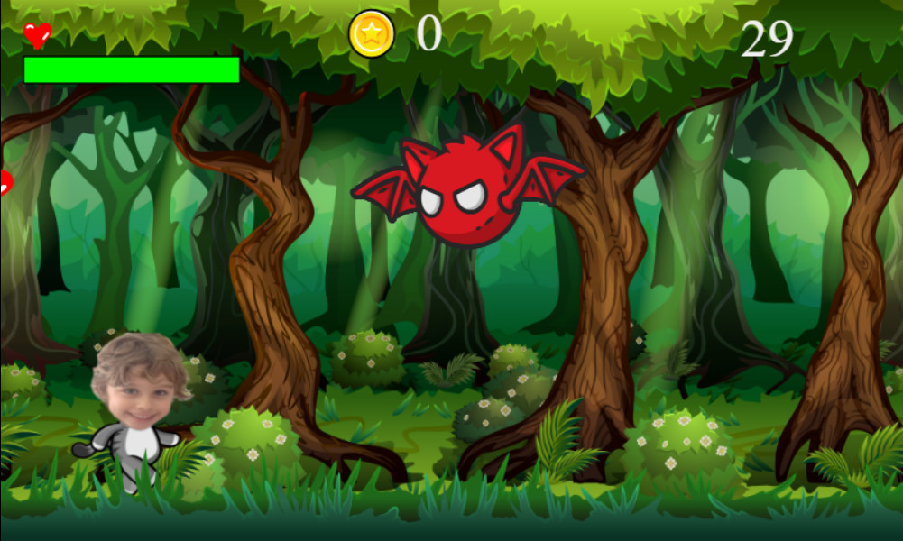

# 🏃‍♂️💨 Clubinho Runner

Welcome to **Clubinho Runner**, a thrilling endless runner where you dodge obstacles, collect coins, and test your reflexes as the speed intensifies! 🎮✨  



---

## 📝 Table of Contents  
- [🌟 Features](#-features)  
- [📥 Installation](#-installation)  
- [🕹️ How to Play](#-how-to-play)  
- [⚙️ Customization](#%EF%B8%8F-customization)  
- [💡 Contributing](#-contributing)  
- [📜 License](#-license)  

---

## 🌟 Features  

✅ **Choose Your Player** – Select from different characters to play.  
✅ **Dynamic Backgrounds** – Change the scenery for a fresh experience.  
✅ **Simple Controls** – Just three keys: `⬅️` `➡️` and `Space`.  
✅ **Progressive Challenge** – The game gets faster as you play.  
✅ **Energy System** – Avoid collisions to keep your energy up.  
✅ **Power-Ups and Points**  
   - ❤️ Collect hearts to restore energy.  
   - 💰 Grab coins to increase your score.  
✅ **Infinite Fun** – No end to the adventure!  

---

## 📥 Installation  

1. Clone the repository:  
   ```bash
   git clone https://github.com/estivalet/clubinho-runner
   cd clubinho-runner/src
   ```

2. Open `index.html` in your browser or start a local server:  
   ```bash
   python -m http.server 8000
   ```

3. Start playing and aim for a high score! 🎉  

---

## 🕹️ How to Play  

1. **Controls**  
   - Move left: `⬅️`  
   - Move right: `➡️`  
   - Jump: `Space`  

2. **Objective**  
   - Avoid enemies to prevent energy loss.  
   - Collect coins to boost your score.  
   - Grab hearts to replenish your energy.  

3. **Challenge**  
   - The game speed increases over time, so stay sharp!  

---

## 💡 Contributing  

Contributions are welcome! Here's how to get involved:  

1. Fork this repository.  
2. Create a feature branch:  
   ```bash
   git checkout -b feature/amazing-feature
   ```  
3. Commit your changes:  
   ```bash
   git commit -m "Add amazing feature 🎉"
   ```  
4. Push the branch:  
   ```bash
   git push origin feature/amazing-feature
   ```  
5. Submit a pull request.  

---

## 📜 License  

This project is licensed under the MIT License. See the [LICENSE](LICENSE) file for more information.  

---

✨ **Enjoy your run and aim for the top score!** 🏆  

Feel free to share your feedback or report issues. Happy gaming! 🎮
